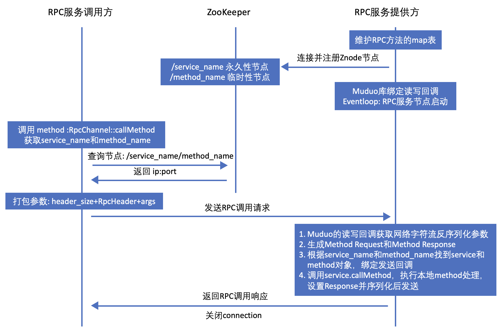
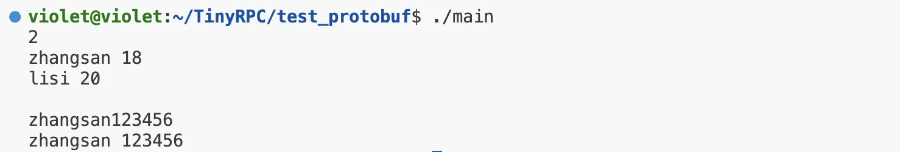
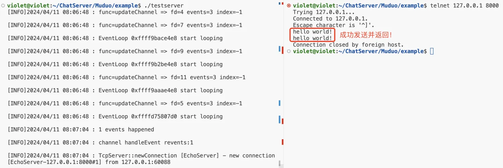
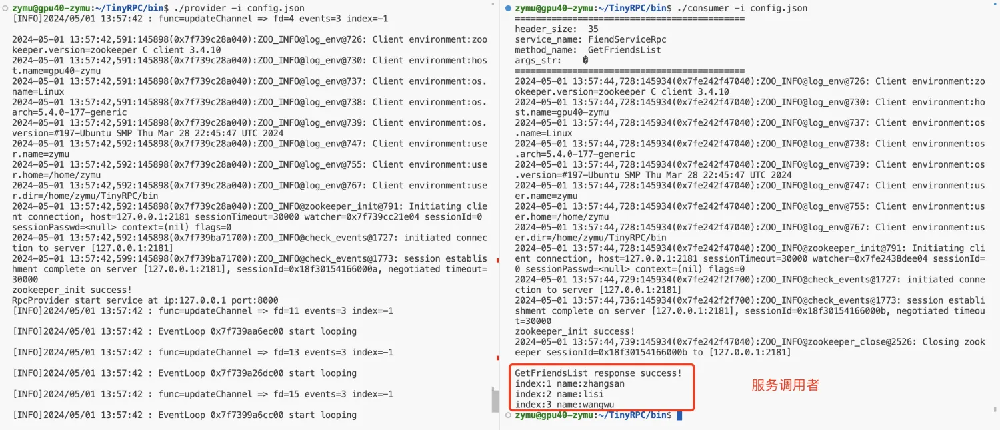

# TinyRPC分布式网络通信框架

- 利用重构**Muduo**网络库实现**RPC**远程过程调用框架
- **Protobuf**实现数据序列化和反序列化，同时防止粘包问题
- **ZooKeeper**分布式协调服务，**异步日志**系统

## TinyRPC服务调用方和服务提供方交互框架图:



## 部署：
### Protobuf
**环境配置：**
```bash
unzip protobuf-master.zip
cd protobuf-master  
sudo apt-get install autoconf automake libtool curl make g++  # 安装所需工具
./autogen.sh   # 自动生成configure配置文件
./configure    # 配置环境
make           # 编译源代码(时间较长)
sudo make install # 安装
sudo ldconfig  # 刷新动态库
```
**测试：**
```bash
cd test_protobuf/   # 进入测试文件夹:
protoc test.proto --cpp_out=./ # protoc的编译命令
g++ main.cc test.pb.cc -lprotobuf -o main # 程序编译链接生成可执行文件
./main   # 执行
```
**成功输出：**




### Muduo网络库：
**安装：**切换到`Muduo`文件夹下，执行`depoly_muduo.sh`脚本一键安装
```bash
cd Muduo/
sudo bash depoly_muduo.sh
```
**测试：**切换到`Muduo/example/`文件夹下，执行`make`生成`testserver`可执行文件
```bash
cd Muduo/example/
make
./testserver
```
**测试结果：**




注意：若报错`bind sockfd:5 fail`可能是因为端口被占用，需要修改`testserver`中`InetAddress addr(8000);`中的端口号。

### Zookeeper分布式协调服务：
```bash
sudo apt-get install openjdk-11-jdk  # 配置Java环境（zk运行需要java环境, 若已有java环境, 可跳过）
tar -xzvf zookeeper-3.4.10.tar.gz  # zookeeper解压
cd zookeeper-3.4.10/conf/
mv zoo_sample.cfg zoo.cfg
## 修改 zoo.cfg 中 dataDir 路径为自定义存放znode节点数据的目录

cd ../bin/  # 进入bin目录
sudo ./zkServer.sh start  # 启动zkServer
ps -ef | grep zookeeper   # 检查zKServer是否成功启动
sudo netstat -tanp  # 检查zKServer是否成功启动(PS: Program name为java)
```
zk的原生开发API(C/C++接口) ：
```bash
cd ../src/c/  # 进入解压目录的src/c
# 源码编译:
sudo ./configure
sudo make
sudo make install
```
确认`/usr/local/lib`目录下存在`libzookeeper_mt.a`
确认`/usr/local/include/zookeeper`目录下存在`zookeeper.h`

### 生成TinyRPC动态库：
执行脚本：`sudo bash ./deploy_all.sh`
`lib`目录下将生成`libTinyRPC.so`

## TinyRPC框架测试：
测试文件源代码位于`example`目录：

- `callee`为服务提供者
- `caller`为服务调用者

生成的可执行文件对应于`bin`目录中的`provider`和`consumer`


